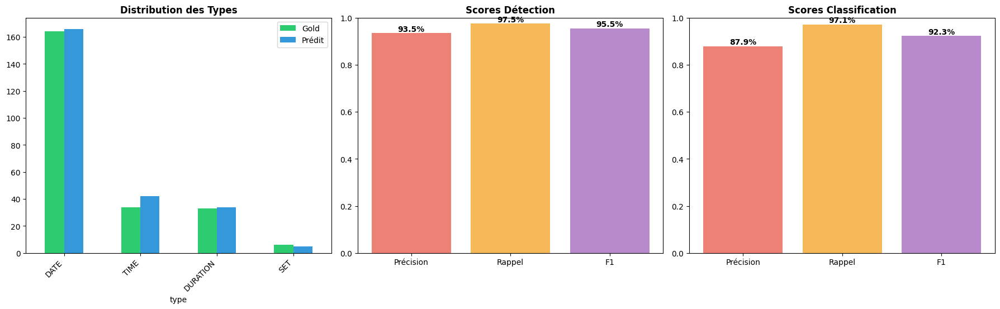

# Extraction d'expressions temporelles : HeidelTime et BERT sur trois domaines

Projet du cours *Extraction d'information* du Master 2 DCI (Université Paris Cité, 2025–2026). On repère et on type les expressions temporelles d'un texte (annotations **TIMEX3** : `DATE`, `TIME`, `DURATION`, `SET`), puis on évalue deux familles de systèmes sur trois registres de langue très différents :

- **HeidelTime** : système à base de règles (Université de Heidelberg), piloté depuis Java ;
- **BERT** pour la classification de tokens : `satyaalmasian/temporal_tagger_BERT_tokenclassifier` (Lange et al., *BERT got a Date*, 2020), appliqué **sans ré-entraînement**.

Chaque prédiction est alignée sur la référence, évaluée sur deux tâches (**détection** de l'expression, **classification** de son type) et stockée dans une base SQLite pour l'analyse d'erreurs.

## Résultats

**Textes historiques — WikiWars** (4 articles : guerre d'Algérie, Première et Seconde Guerres mondiales, Révolution française), moyennes :

| Système | Détection P / R / F1 | Classification P / R / F1 |
|---|---|---|
| HeidelTime (règles) | **99,8** / 85,3 / 91,9 | **92,0** / 83,0 / 87,2 |
| BERT | 94,0 / **93,4** / **93,7** | 88,8 / **92,6** / **90,6** |

HeidelTime ne se trompe presque jamais mais oublie environ 15 % des expressions. BERT est plus équilibré et obtient le meilleur F1.

**BERT hors de son domaine d'origine** (F1, correspondance stricte → souple) :

| Corpus | Détection | Classification |
|---|---|---|
| Comptes rendus d'urgences (MTSamples) | 42,9 → 75,8 | 38,1 → 66,9 |
| Tweets (SynTime) | 86,4 → **95,5** | 91,8 → **92,3** |

Sur le médical, l'écart entre les deux modes vient surtout des frontières d'expressions et des conventions d'annotation : une adaptation au domaine serait nécessaire. Sur les tweets, le modèle reste très robuste malgré le langage informel.



L'état de l'art (HeidelTime, PTime, approches neuronales) et l'analyse détaillée des erreurs sont dans le [rapport](docs/rapport.pdf) ; les [transparents](docs/presentation.pdf) résument le projet.

## Contenu

```
notebooks/
  wikiwars_historical.ipynb   # BERT sur WikiWars : chargement SGML/XML, extraction, métriques, figures, SQLite
  medical_mtsamples.ipynb     # BERT sur MTSamples : correspondance exacte et par chevauchement, export SQLite/CSV
  tweets_preprocess.ipynb     # fichiers .tml SynTime -> CSV (texte brut + texte annoté)
  tweets_syntime.ipynb        # BERT sur les tweets : correspondance stricte et souple
heideltime/
  HeidelTimePipeline.java     # HeidelTime standalone sur WikiWars + évaluation + base SQLite
  config.props                # configuration HeidelTime
  results_wikiwars.txt        # journal d'exécution avec les scores
figures/                      # graphiques de résultats par corpus
docs/                         # rapport et présentation
```

## Données (non incluses)

| Corpus | Source | Emplacement attendu par défaut |
|---|---|---|
| WikiWars | Mazur & Dale (2010), fichiers `*.sgm` + `*.key.xml` | `/kaggle/input/wikiwars/` (variable `base_path`) |
| MTSamples annotés | [Viani et al. 2019 — timeline-reconstruction](https://github.com/medesto/timeline-reconstruction) + textes [mtsamples.com](https://www.mtsamples.com) | `text_folder`, `annotations_path` |
| Tweets | [SynTime](https://github.com/xszhong/syntime) (jeu de test `.tml`) | `csv_path` |

Les notebooks BERT ont été exécutés sur Kaggle (GPU) ; il suffit d'adapter les chemins dans les cellules d'exécution.

## Lancer

**BERT**

```bash
pip install torch transformers pandas matplotlib seaborn beautifulsoup4 lxml nltk jupyter
jupyter notebook notebooks/wikiwars_historical.ipynb
```

**HeidelTime** (Java 11+) : télécharger [HeidelTime standalone](https://github.com/HeidelTime/heideltime/releases) (`heideltime.jar`) et le pilote [sqlite-jdbc](https://github.com/xerial/sqlite-jdbc/releases), placer les fichiers WikiWars dans le dossier courant, puis :

```bash
javac -cp "heideltime.jar;sqlite-jdbc.jar" heideltime/HeidelTimePipeline.java -d out
java  -cp "out;heideltime.jar;sqlite-jdbc.jar" HeidelTimePipeline
```

Sous Linux et macOS, remplacer `;` par `:` dans le classpath.

## Licence

Code distribué sous [licence MIT](LICENSE). Les corpus (WikiWars, MTSamples, SynTime) et HeidelTime relèvent de leurs propres licences.

## Auteurs

**Amar Merabti** et **Lynda Hammouche** — Master 2 DCI, Université Paris Cité.
